<h1>目錄</h1>

- 2、[IOC 理論推導](#s1)
  - 2-1、[IOC 推導](#s2)
    - 2-1-1、[Spring 之 Maven 設定](#s3)
    - 2-1-2、[創建 Spring 項目](#s4)
    - 2-1-3、[基礎接口創建](#s5)
    - 2-1-4、[Service 優化](#s6)
    - 2-1-5、[使用 Set 接口實現的變化](#s7)
  - 2-2、[IOC 本質](#s8)

---

# 2、 IOC 理論推導<span id="s1"/>

- **接口創建步驟 : 思想由此開始轉變**

1. UserDao 接口
2. UserDaoImpl 實現類
3. UserService 業務接口
4. UserServiceImpl 業務實現類

## 2-1、IOC 推導<span id="s2"/>

### 2-1-1、Spring 之 Maven 設定<span id="s3"/>

- **建立 Project**
  


- **創建 Maven 項目**


- **設定詳細資訊 > Next** (建立完成)


- **修改 pom.xml**

```xml
<!-- 新增 webmvc 包，內涵 Spring 所需套件-->
<dependencies>
    <dependency>
        <groupId>org.springframework</groupId>
        <artifactId>spring-webmvc</artifactId>
        <version>5.3.6</version>
    </dependency>
</dependencies>
```

- **Maven > Reload Project** (Maven 套件加載，完成後可看見 Dependencies 資料夾)


### 2-1-2、創建 Spring 項目<span id="s4"/>

- **Project 右鍵 > 創建 Model**


- **Next**
  


- **修改 Name > Finish** (Name 相同的話會有提示，需修改)


### 2-1-3、基礎接口創建<span id="s5"/>

- **目錄**


- **創建 UserDao.java**
  
```java
package com.kuang.dao;

public interface UserDao {
    void getUser();
}
```

- **創建 UserDaoImpl.java**
  
```java
package com.kuang.dao;

public class UserDaoImpl implements UserDao{
    @Override
    public void getUser() {
        System.out.println("默認獲取用戶數據");
    }
}
```

- **創建 UserDaoMySqlImpl.java**
  
```java
package com.kuang.dao;

public class UserDaoMySqlImpl implements UserDao{
    @Override
    public void getUser() {
        System.out.println("獲取MySql數據");
    }
}
```

- **創建 UserDaoOracleImpl.java**
  
```java
package com.kuang.dao;

public class UserDaoOracleImpl implements UserDao{
    @Override
    public void getUser() {
        System.out.println("獲取Oracle數據");
    }
}
```

- **創建 UserService.java**
  
```java
package com.kuang.service;

public interface UserService {
    void getUser();
}
```
- **創建 UserServiceImpl.java**

```java
package com.kuang.service;

import com.kuang.dao.UserDao;
import com.kuang.dao.UserDaoImpl;

public class UserServiceImpl implements UserService{

    private UserDao userDao = new UserDaoImpl();

    @Override
    public void getUser() {
        userDao.getUser();
    }
}
```

- **MyTest.java (測試類)，之後可在此執行程式碼並進行測試**
  
```java
import com.kuang.service.UserService;
import com.kuang.service.UserServiceImpl;

public class MyTest {
    public static void main(String[] args) {
        // 這樣造成的缺點是，每創建一個新的 ServiceImpl 的話就要將 new UserServiceImpl() 改動。這樣會在後期程式碼改動會更大 
        UserService userService = new UserServiceImpl();
        userService.getUser();
    }
}
```

### 2-1-4、Service 優化<span id="s6"/>

- **修改 UserServiceImpl.java，代碼替用性更強**
  
```java
public class UserServiceImpl implements UserService{
    // 舊寫法 :
    // private UserDao userDao = new UserDaoImpl();
    private UserDao userDao;

    // 新增 set :
    // 利用 set 進行動態實現值的注入
    public void setUserDao(UserDao userDao){
        this.userDao = userDao;
    }

    @Override
    public void getUser() {
        userDao.getUser();
    }
}
```

- **新增 setUserDao 方法**

```java
package com.kuang.service;

import com.kuang.dao.UserDao;

public interface UserService {
    void setUserDao(UserDao userDao);
    void getUser();
}
```

- **修改 main 方法**

```java
import com.kuang.dao.UserDaoMySqlImpl;
import com.kuang.service.UserService;
import com.kuang.service.UserServiceImpl;

public class MyTest {
    public static void main(String[] args) {
        // UserServiceImpl 不須再更動
        UserService userService = new UserServiceImpl();
        userService.setUserDao(new UserDaoMySqlImpl()); // 獲取MySql數據
        userService.getUser();
    }
}
```

> 結論:
> 1. 測試後會發現，值就會因 setUserDao 而改變，就無需重複且大量的修改資料
> 2. 在之前的業務中，用戶的需求可能會影響我們的原來代碼，我們需要根據用戶的需求去修改原代碼!如果程序代碼量十分，修改一次的成本代價十分昂貴!

### 2-1-5、使用 Set 接口實現的變化<span id="s7"/>

- **我們使用一個 Set 接口實現，已經發生了革命性的變化!**

```java
private UserDao userDao;

public void setUserDao(UserDao userDao){
    this.userDao = userDao;
}
```

- **之前，程序是主動創建對象!控制權在程序員手上!**
- **使用了 set 注入後，程序不在具有主動性，而是被動的接受對象!**

> 這種思想，從本質上解決了問題，我們程序員不用再去管理對象的創建了(就是不用在管理 <u>new Object()</u>，不須再修改 <u>Object</u> )。系統的耦合性大大降低~，可以更加專注的在業務的實現上(不需要修改Service了)!


## 2-2、 IOC 本質<span id="s8"/>



- **控制反轉 IOC (Inversion of Control)，是一種設計思想，DI(依賴注入)是實現 IOC 的一種方法**，也有人認為 DI 只是 IOC 的另一種說法。沒有IOC的程序中，我們使用面向對向編程，對象的創建與對象間的依賴關係完全硬編碼在程序中，對象的創建由程序自己控制，控制反轉後將對向的創建轉移給第三方，個人認為所謂控制反轉就是: 獲得依賴對象的方式反轉了。


- **IOC 是 Spring 框架的核心內容**，使用多種方式完美的實現 IOC，可以使用 XML 配置，也可以使用註解，新版本的 Spring 也可以零配置 IOC (即自動裝配)。
  
- Spring 容器在初始化時鮮讀取配置文件，根據配置文件或元數據創建與組織度向存入容器中，程序使用時在從IOC容器中取出需要的對象。


- 採用 XML 方式配置 Bean 時候，Bean 的定義信息是和實現分離的，而採用註解的方式可以把兩者合為一體，Bean 的定義信息直接以註解的形式定義在實現類中，從而達到了零配置的目的。

- **控制反轉是一種通過描述(XML或註解)通過第三方去生產或獲取特定對象的方式。在Spring中實現控制反轉的是IOC容器，其實現方法是依賴注入(Dependency Injection,DI)。**

---

- [【狂神說Java】3、IOC 理論推導](https://www.bilibili.com/video/BV1WE411d7Dv?p=3&spm_id_from=pageDriver)
- [【狂神說Java】4、IOC 本質](https://www.bilibili.com/video/BV1WE411d7Dv?p=4&spm_id_from=pageDriver)