<h1>目錄</h1>

- 10、[代理模式](#s1)
  - 10-1、[靜態代理](#s2)
  - 10-2、[加深靜態代理理解](#s3)

---

# 10、代理模式 <span id="s1"/>

- **為什麼要學代理模式 ? 因為這是 SpringAOP 的底層 ! (面試常考 SpringAOP 與 SpringMVC)**
- **代理模式的分類**
  - **靜態代理**
  - **動態代理**

## 10-1、靜態代理 <span id="s2"/>

- **角色分析 :**
  - **抽象角色 : 一般會使用接口或者抽象類來解決**
  - **真實角色 : 被代理的角色**
  - **代理角色 : 代理真實角色，代理真實角色後，我們一般會做一些附屬操作**
  - **客戶 : 訪問代理對象的人 !**



> **靜態代理實現步驟** :
> - **創建接口**
> - **創建真實角色**
> - **創建代理角色**
> - **客戶端訪問代理角色**

- **目錄**


- **創建 Rent.java 介面 (創建接口)**

```java
package com.kuang.demo01;

// 租房
public interface Rent {

    public void rent();

}
```

- **創建 Host.java 表示房東 (創建真實角色)**

```java
package com.kuang.demo01;

// 房東
public class Host implements Rent{

    @Override
    public void rent() {
        System.out.println("房東要出租房子!");
    }
}
```

- **創建 Proxy.java 代表房仲 (創建代理角色)**

```java
package com.kuang.demo01;

// 仲介
public class Proxy implements Rent{

    private Host host;

    public Proxy(){

    }

    public Proxy(Host host) {
        this.host = host;
    }

    @Override
    public void rent(){
        seeHouse();
        host.rent();
        hetong();
        fare();
    }

    // 看房
    public void seeHouse(){
        System.out.println("仲介帶你看房");
    }

    // 收仲介費
    public void fare(){
        System.out.println("收仲介費");
    }

    // 簽合同
    public void hetong(){
        System.out.println("簽租賃合同");
    }
}
```

- **創建 Client.java (客戶端訪問代理角色)**

```java
package com.kuang.demo01;

public class Client {
    public static void main(String[] args) {
        // 房東要租房子
        Host host = new Host();
        // 代理，中介幫房東租房子，但是呢? 代理角一般會有一些附屬操作!
        Proxy proxy = new Proxy(host);

        // 你不用面對房東，直接找仲介租房即可!
        proxy.rent();
    }
}
```

> **代理模式** :
>   - **好處** :
>     - **可以使真實角色的操作更加純粹!不用去關注一些公共的業務**
>     - **公共業務也就交給代理角色!實現了業務的分工!**
>     - **公共業務發生拓展的時候，方便集中管理!**
>   - **缺點** :
>     - **一個真實角色就會產生一個代理角色; 代碼量會翻倍~ 開發效率會變低~**

## 10-2、加深靜態代理理解 <span id="s3"/>

- **聊聊 AOP**



> **AOP 加深理解與實現** :
> - **在原有模式下是由 dao > service > controller > 前端**
> - **但開既有功能開發完成後，需要額外開發那就要用到 AOP 的實現機制 "代理"，進行橫向開發**

- **目錄**


- **創建接口**

```java
package com.kuang.demo02;

// 1. 創建接口 (抽象業務)
public interface UserService {
    public void add();
    public void delete();
    public void update();
    public void query();
}
```

- **真實對象**

```java
package com.kuang.demo02;

// 2. 真實對象
public class UserServiceImpl implements UserService{
    @Override
    public void add() {
        System.out.println("增加了一個用戶");
    }

    @Override
    public void delete() {
        System.out.println("刪除了一個用戶");
    }

    @Override
    public void update() {
        System.out.println("修改了一個用戶");
    }

    @Override
    public void query() {
        System.out.println("查詢了一個用戶");
    }
}
```

- **代理角色**

```java
package com.kuang.demo02;

// 3. 代理角色
public class UserServiceProxy implements UserService{

    private UserServiceImpl userService;

    public void setUserService(UserServiceImpl userService) {
        this.userService = userService;
    }

    @Override
    public void add() {
        log("add");
        userService.add();
    }

    @Override
    public void delete() {
        log("delete");
        userService.add();
    }

    @Override
    public void update() {
        log("update");
        userService.add();
    }

    @Override
    public void query() {
        log("query");
        userService.add();
    }

    // 日誌方法
    public void log(String msg) {
        System.out.println("[Debug] 使用了"+msg+"方法");
    }
}
```

- **客戶端訪問代理角色**

```java
package com.kuang.demo02;

// 4. 客戶端訪問代理角色
public class Client {
    public static void main(String[] args) {
        UserServiceImpl userService = new UserServiceImpl();

        UserServiceProxy proxy = new UserServiceProxy();
        proxy.setUserService(userService);
        proxy.add();
    }
}
```

---

- [【狂神說Java】17、靜態代理模式](https://www.bilibili.com/video/BV1WE411d7Dv?p=17&spm_id_from=pageDriver)
- [【狂神說Java】18、靜態代理再理解](https://www.bilibili.com/video/BV1WE411d7Dv?p=18&spm_id_from=pageDriver)

---

- [面向對象七大原則(Object-Oriented Programming System)](https://blog.csdn.net/yanbober/article/details/45312243)